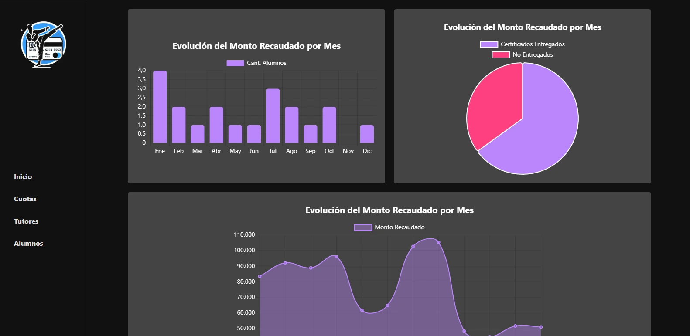
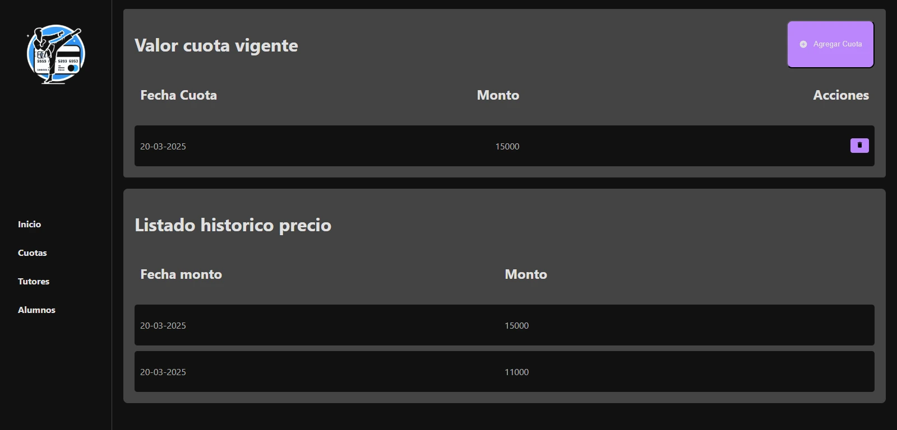
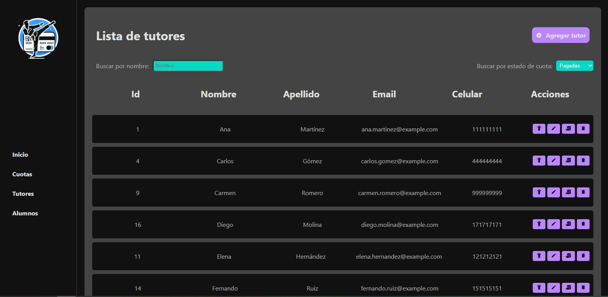
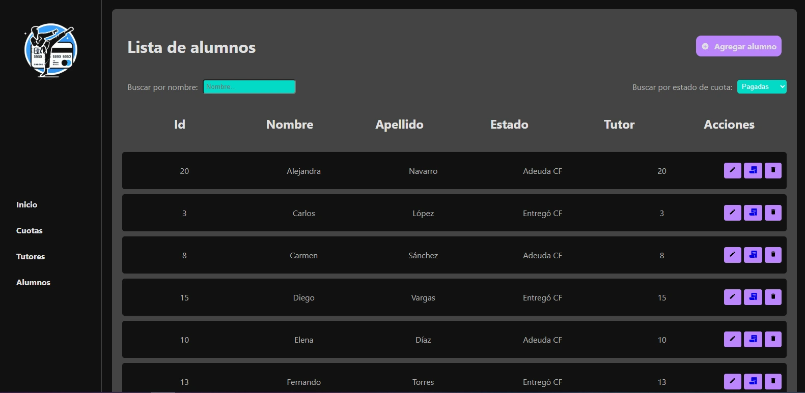
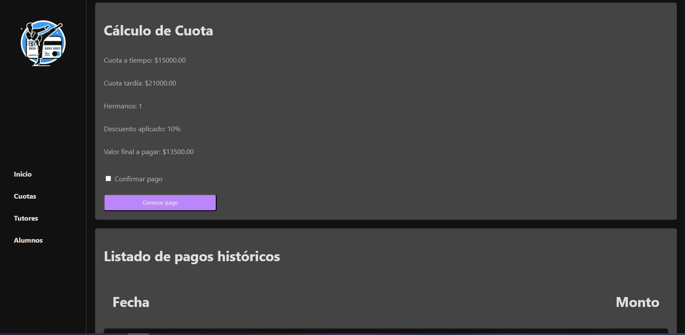
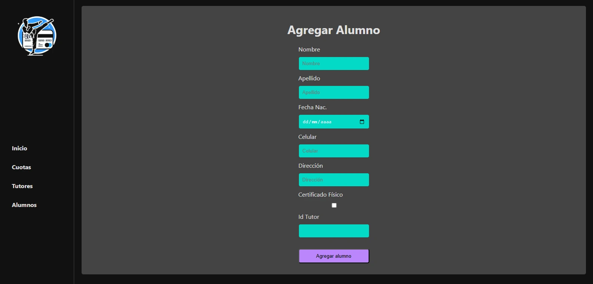

# TakeFee 🧾

**TakeFee** es una aplicación web diseñada para facilitar la **gestión de cuotas y pagos** en clubes, organizaciones o comunidades. Permite registrar usuarios, asignar cuotas, hacer seguimiento de pagos y visualizar estadísticas, todo desde una plataforma intuitiva y moderna.

## 🚀 Tecnologías Utilizadas

- **Frontend**: React, TypeScript, Vite
- **Backend**: Node.js, Express
- **Base de datos**: MySQL
- **ORM**: Sequelize
- **Control de versiones**: Git & GitHub

## 🎯 Funcionalidades Principales

- ✅ Registro y autenticación de usuarios
- ✅ Gestión de socios/miembros
- ✅ Asignación de cuotas mensuales/personalizadas
- ✅ Registro de pagos
- ✅ Reportes y estadísticas visuales
- ✅ Roles de usuario (admin, usuario común)

## 🧰 Instalación y ejecución

### 1. Clona el repositorio

```bash
git clone https://github.com/lucasmaggi03/debt-collection-software.git
cd debt-collection-software
```

### 2. Configura variables de entorno

Crea un archivo `.env` en el backend con tus configuraciones:

```env
DB_HOST=localhost
DB_USER=tu_usuario
DB_PASSWORD=tu_contraseña
DB_NAME=takefee_db
PORT=4000
```

### 3. Instala dependencias

#### Backend

```bash
cd backend
npm install
```

#### Frontend

```bash
cd frontend
npm install
```

### 4. Corre el proyecto

#### Backend

```bash
npm run dev
```

#### Frontend

```bash
npm run dev
```

## 🖼 Capturas de pantalla







## 🛡️ Licencia

Este proyecto está bajo la Licencia MIT. Ver el archivo `LICENSE` para más información.

## 🤝 Contribuciones

¡Las contribuciones son bienvenidas! Abrí un issue o enviá un PR con mejoras, correcciones o nuevas ideas.

---

## 📫 Contacto

Hecho con 💻 por [Lucas Maggi](mailto:lucasmaggi03@gmail.com)
